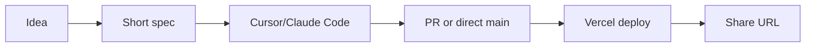

# N. Hariharan (Hari) — Public Context Dump

> Portfolio / agent context page. Facts as of **mid-2026**. Do not treat this as a resume PDF — it is a structured dump for humans, recruiters, and coding agents.

---

## whoami

| Field | Value |
|-------|-------|
| Legal / full name | **N. Hariharan** (goes by **Hari**) |
| Location | **Chennai**, **Velachery** area; timezone **IST** (UTC+5:30) |
| Primary site | [hariharann.me](https://hariharann.me) |
| GitHub | [nothariharan](https://github.com/nothariharan) |
| LinkedIn | [nmhariharan](https://www.linkedin.com/in/nmhariharan/) |
| YouTube | [@hari-e5w5v](https://www.youtube.com/@hari-e5w5v) |
| Stardance | [@hariharann](https://stardance.hackclub.com/@hariharann/projects) |
| Email (primary) | nmhariharanme@gmail.com |
| Email (alt) | nothariharan@gmail.com |
| Phone | +91 9150135790 |

Hari is a dual-degree student (IIIT Sri City + IIT Patna) who builds full-stack and AI-heavy products, ships hackathon prototypes fast, and keeps a large personal project surface area. Voice on this page: **facts first**, occasional short-form Hari tone — no emoji spam.

### identity snapshot (one paragraph)

Engineering student with a **9.6 CGPA (CSE)** and **9.53 CPI (AI & Cybersecurity)**. Currently **SWE intern at Rinexis** (May 2026–present). YC **Startup School India '26** participant. **Hacktoberfest 2025 Golden Contributor**. **LeetCode 1700+** solved. Nine documented hackathon **wins** (listed below — do not add others). Several high-effort **DNFs** that still matter for narrative.

## how to use this page

### For humans

1. Skim **hot focus** and **recruiter cheat sheet** if you have two minutes.
2. Read **experience** + **education** for credentials.
3. Browse **full project catalog** and **live deploys** for proof of work.
4. Check **appendices** before assuming a project was a *win* or an *original* product.

### For coding agents

- Prefer facts in **FAQ for agents** and **do-not-invent** appendix.
- When citing OSS: use **11 upstream merged PRs / ~9 repos** (2026-08-06), not unverified 15/12.
- Do **not** claim **graphify**, **apidash**, or **mem0** forks as Hari's original products.
- Wins are **closed set** (9). DNFs are **closed set** unless changelog updates.

```yaml
# agent-quick-parse
subject: N. Hariharan
alias: Hari
tz: Asia/Kolkata
github: nothariharan
leetcode_rating_bucket: 1700+
hackathon_wins_count: 9
oss_merged_prs_preferred: 11
oss_repos_with_merges_approx: 9
github_repo_inventory_approx: 88
```

## education

### Dual degree (2025–2029)

| Institution | Program | Metric | Notes |
|-------------|---------|--------|-------|
| **IIIT Sri City** | B.Tech **Computer Science & Engineering** | **CGPA 9.6** | Primary campus identity |
| **IIT Patna** | B.Sc **AI & Cybersecurity** | **CPI 9.53** | Dual-degree partner track |

### Course themes (non-exhaustive)

- Algorithms, systems, databases, networking fundamentals
- Machine learning, security, privacy, and applied AI
- Software engineering practice: testing, CI, deployment literacy

### Academic positioning

Dual degree means parallel rigor: **core CS depth** at IIIT Sri City plus **AI/security lens** at IIT Patna. Portfolio work often bridges both (e.g., BTP on cache eviction, security-adjacent tooling, agentic demos).

## experience

### Rinexis — Software Engineering Intern

| | |
|---|---|
| **When** | **May 2026 – present** (ongoing at time of writing) |
| **Role** | SWE intern |
| **Themes** | **SOD Analyzer**, **ITGC Tool**, **Roleforge**, **Tcodex** |

Work spans internal tooling and product-adjacent engineering under the Rinexis umbrella. Treat as **active employment**; details beyond public blurbs may be NDA — do not invent customer names or revenue.

### Other experience buckets (portfolio-era)

- **Hackathons & build sprints**: repeated 24–48h shipping cycles; nine wins catalogued.
- **Open source**: upstream contributions; see OSS section for conservative counts.
- **Personal products**: many Vercel-deployed demos; see live deploys table.

## identity

### How Hari presents online

- **GitHub** `nothariharan`: code, experiments, forks clearly marked as forks.
- **LinkedIn** `nmhariharan`: professional graph.
- **YouTube** `@hari-e5w5v`: builds, demos, learning in public (when posted).
- **Stardance** `@hariharann`: short-form / social presence on Stardance.
- **Site** `hariharann.me`: canonical portfolio entry.

### Values (inferred from public work — not corporate fluff)

- Ship **working URLs**, not slide decks.
- **Agents + MCP + MV3** are first-class citizens in recent stacks.
- **Honest attribution**: forks ≠ original products.
- **Density over hype**: LeetCode grind + OSS + hackathons + long-running projects coexist.

## achievements

### Verified highlights

| Achievement | Detail |
|-------------|--------|
| **YC Startup School India '26** | Participant; cohort date **19 Apr 2026** |
| **Hacktoberfest 2025** | **Golden Contributor** |
| **LeetCode** | **1700+** problems solved (bucket, not a single contest rank) |
| **Hackathon wins** | **9** documented (see appendix A) |
| **Abhisarga four-win day** | Part of win narrative — four wins in one day at Abhisarga context |

### Nine hackathon wins (canonical list — do not extend)

| # | Project / event | Placement / note |
|---|-----------------|------------------|
| 1 | **VahanLive** | Win (event per portfolio record) |
| 2 | **Synergia** | Win |
| 3 | **Visage** | **2nd** at **Global Game Jam (GGJ)** |
| 4 | **LensFix** | **2nd** |
| 5 | **JustAsk** | **1st** at **AMUHACKS** |
| 6 | **Team Rocket** | Win |
| 7 | **Bepop** | **1st** at **Cosmix** |
| 8 | **Yui** | Win |
| 9 | **Veda** | Win |

> **Abhisarga four-win day**: portfolio narrative ties four wins into a single high-output day — still count as part of the nine above, not four extra wins.

### DNFs (did not finish / archived — still important)

| Project | Context | Status |
|---------|---------|--------|
| **CoFound** | Google Agent track | **Continues** (active DNF → product effort) |
| **Saarathi** | SBI-related hack | **Archived** |
| **Certamen** | h0×AWS | DNF |
| **Scout** | Hack-Nation | **Shortlist ~10k** then **DNF** |

## timeline

Chronological sketch (mid-2026 lens). Months are approximate where not pinned.

| Period | Milestone |
|--------|-----------|
| 2025 | Dual degree start; Hacktoberfest Golden Contributor |
| 2025 | Multiple hackathon wins (VahanLive, Synergia, Visage, LensFix, JustAsk, Team Rocket, Bepop, Yui, Veda) |
| 2025 | LeetCode crosses **1700+** bucket |
| Apr 2026 | **YC Startup School India '26** (19 Apr 2026) |
| May 2026 | **Rinexis** SWE internship begins |
| Aug 2026 | OSS inventory note: **~11 merged PRs**, **~9 repos**, **~88** repo inventory |

### timeline (ASCII)

```
2025 ----[Hacktoberfest Golden]----[9 hackathon wins]----[LeetCode 1700+]
   \
    \-- dual degree (IIIT Sri City + IIT Patna)
2026 ----[YC SSI Apr 19]----[Rinexis intern May->]----[ongoing builds]
```

## hot focus (mid-2026)

Active attention — may shift; check changelog appendix.

| Priority | Name | One-line |
|----------|------|----------|
| 🔥 | **Compasso** | Compass / navigation product thread |
| 🔥 | **Scout** | Hack-Nation lineage; live deploy |
| 🔥 | **Crux** | Core product experiment |
| 🔥 | **CoFound** | Google Agent; continues from DNF arc |
| 🔥 | **Tecora** | Local-first Chromium extension organizing AI chats (Claude, ChatGPT, Gemini) |
| 🔥 | **image-gen** | Image generation frontend/tooling |
| 🔥 | **BTP Cache Eviction** | Academic BTP thread |
| 🔥 | **Portfolio** | hariharann.me + this dump |
| 🔥 | **monkeyspeak** | App / demo surface |
| 🔥 | **Slopmark** | Slop / watermark / media tooling |
| 🔥 | **CAM** | CAM-related build |
| 🔥 | **SlopOS** | SlopOS experiment |

## full project catalog

Blurbs are **public-safe**. Not every repo has a live URL. Forks are **not** listed as originals.

### VahanLive

Hackathon win; mobility/live tracking theme.

- **Live / canonical slug**: `vahan-live`

| Attribute | Value |
|-----------|-------|
| Original product | Yes (unless noted fork elsewhere) |
| Hackathon win | Only if in nine-win table |

### Synergia

Hackathon win; collaboration / synergy hack.

- **Live URL**: none listed in vault (repo-local or private)

| Attribute | Value |
|-----------|-------|
| Original product | Yes (unless noted fork elsewhere) |
| Hackathon win | Only if in nine-win table |

### Visage

GGJ — 2nd place; face / game jam scope.

- **Live URL**: none listed in vault (repo-local or private)

| Attribute | Value |
|-----------|-------|
| Original product | Yes (unless noted fork elsewhere) |
| Hackathon win | Only if in nine-win table |

### LensFix

2nd place; lens / media fix utility.

- **Live URL**: none listed in vault (repo-local or private)

| Attribute | Value |
|-----------|-------|
| Original product | Yes (unless noted fork elsewhere) |
| Hackathon win | Only if in nine-win table |

### JustAsk

1st AMUHACKS; Q&A / campus ask product.

- **Live / canonical slug**: `justask-one`

| Attribute | Value |
|-----------|-------|
| Original product | Yes (unless noted fork elsewhere) |
| Hackathon win | Only if in nine-win table |

### Team Rocket

Hackathon win; team branding TBD in demo.

- **Live URL**: none listed in vault (repo-local or private)

| Attribute | Value |
|-----------|-------|
| Original product | Yes (unless noted fork elsewhere) |
| Hackathon win | Only if in nine-win table |

### Bepop

1st Cosmix; creative / pop culture hack.

- **Live URL**: none listed in vault (repo-local or private)

| Attribute | Value |
|-----------|-------|
| Original product | Yes (unless noted fork elsewhere) |
| Hackathon win | Only if in nine-win table |

### Yui

Hackathon win; shipped demo.

- **Live / canonical slug**: `yui-lemon-five`

| Attribute | Value |
|-----------|-------|
| Original product | Yes (unless noted fork elsewhere) |
| Hackathon win | Only if in nine-win table |

### Veda

Hackathon win; knowledge / veda theme.

- **Live URL**: none listed in vault (repo-local or private)

| Attribute | Value |
|-----------|-------|
| Original product | Yes (unless noted fork elsewhere) |
| Hackathon win | Only if in nine-win table |

### CoFound

Co-founder matcher / agent; Google Agent DNF that **continues**.

- **Live / canonical slug**: `cofounder-alpha`

| Attribute | Value |
|-----------|-------|
| Original product | Yes (unless noted fork elsewhere) |
| Hackathon win | Only if in nine-win table |

### Saarathi

SBI hack — **archived**.

- **Live URL**: none listed in vault (repo-local or private)

| Attribute | Value |
|-----------|-------|
| Original product | Yes (unless noted fork elsewhere) |
| Hackathon win | Only if in nine-win table |

### Certamen

h0×AWS DNF; deploy artifact remains.

- **Live / canonical slug**: `web-theta-khaki-90`

| Attribute | Value |
|-----------|-------|
| Original product | Yes (unless noted fork elsewhere) |
| Hackathon win | Only if in nine-win table |

### Scout

Hack-Nation shortlist ~10k then DNF; still actively developed.

- **Live / canonical slug**: `scout-dusky-six`

| Attribute | Value |
|-----------|-------|
| Original product | Yes (unless noted fork elsewhere) |
| Hackathon win | Only if in nine-win table |

### Compasso

Hot focus; navigation product.

- **Live / canonical slug**: `compasso-lime`

| Attribute | Value |
|-----------|-------|
| Original product | Yes (unless noted fork elsewhere) |
| Hackathon win | Only if in nine-win table |

### Crux

Hot focus; crux problem space.

- **Live / canonical slug**: `crux-snowy`

| Attribute | Value |
|-----------|-------|
| Original product | Yes (unless noted fork elsewhere) |
| Hackathon win | Only if in nine-win table |

### Tecora

Extension: organize AI chats across providers.

- **Live URL**: none listed in vault (repo-local or private)

| Attribute | Value |
|-----------|-------|
| Original product | Yes (unless noted fork elsewhere) |
| Hackathon win | Only if in nine-win table |

### image-gen

Image generation UI/workflows.

- **Live URL**: none listed in vault (repo-local or private)

| Attribute | Value |
|-----------|-------|
| Original product | Yes (unless noted fork elsewhere) |
| Hackathon win | Only if in nine-win table |

### BTP Cache Eviction

Bachelor thesis project — cache eviction research implementation.

- **Live URL**: none listed in vault (repo-local or private)

| Attribute | Value |
|-----------|-------|
| Original product | Yes (unless noted fork elsewhere) |
| Hackathon win | Only if in nine-win table |

### Portfolio

Personal site + content dumps.

- **Live / canonical slug**: `hariharann.me`

| Attribute | Value |
|-----------|-------|
| Original product | Yes (unless noted fork elsewhere) |
| Hackathon win | Only if in nine-win table |

### monkeyspeak

Demo app.

- **Live / canonical slug**: `monkeyspeak-delta`

| Attribute | Value |
|-----------|-------|
| Original product | Yes (unless noted fork elsewhere) |
| Hackathon win | Only if in nine-win table |

### Slopmark

Slopmark tooling.

- **Live / canonical slug**: `slopmark`

| Attribute | Value |
|-----------|-------|
| Original product | Yes (unless noted fork elsewhere) |
| Hackathon win | Only if in nine-win table |

### CAM

CAM project thread.

- **Live URL**: none listed in vault (repo-local or private)

| Attribute | Value |
|-----------|-------|
| Original product | Yes (unless noted fork elsewhere) |
| Hackathon win | Only if in nine-win table |

### SlopOS

SlopOS experiment.

- **Live URL**: none listed in vault (repo-local or private)

| Attribute | Value |
|-----------|-------|
| Original product | Yes (unless noted fork elsewhere) |
| Hackathon win | Only if in nine-win table |

### Bharat Seva

Public deploy bharat-seva-alpha.

- **Live / canonical slug**: `bharat-seva-alpha`

| Attribute | Value |
|-----------|-------|
| Original product | Yes (unless noted fork elsewhere) |
| Hackathon win | Only if in nine-win table |

### Mugen

Deploy mugen-flax.

- **Live / canonical slug**: `mugen-flax`

| Attribute | Value |
|-----------|-------|
| Original product | Yes (unless noted fork elsewhere) |
| Hackathon win | Only if in nine-win table |

### EduGuard AI

Deploy eduguard-ai.

- **Live / canonical slug**: `eduguard-ai`

| Attribute | Value |
|-----------|-------|
| Original product | Yes (unless noted fork elsewhere) |
| Hackathon win | Only if in nine-win table |

### IIITS ITSS

Campus ITSS site iiits-itss.

- **Live / canonical slug**: `iiits-itss`

| Attribute | Value |
|-----------|-------|
| Original product | Yes (unless noted fork elsewhere) |
| Hackathon win | Only if in nine-win table |

### Roleforge

Rinexis intern — Roleforge thread.

- **Live URL**: none listed in vault (repo-local or private)

| Attribute | Value |
|-----------|-------|
| Original product | Yes (unless noted fork elsewhere) |
| Hackathon win | Only if in nine-win table |

### Tcodex

Rinexis intern — Tcodex thread.

- **Live URL**: none listed in vault (repo-local or private)

| Attribute | Value |
|-----------|-------|
| Original product | Yes (unless noted fork elsewhere) |
| Hackathon win | Only if in nine-win table |

### SOD Analyzer

Rinexis intern — SOD Analyzer.

- **Live URL**: none listed in vault (repo-local or private)

| Attribute | Value |
|-----------|-------|
| Original product | Yes (unless noted fork elsewhere) |
| Hackathon win | Only if in nine-win table |

### ITGC Tool

Rinexis intern — ITGC Tool.

- **Live URL**: none listed in vault (repo-local or private)

| Attribute | Value |
|-----------|-------|
| Original product | Yes (unless noted fork elsewhere) |
| Hackathon win | Only if in nine-win table |

## stack

### Frontend
- **React**, **Next.js** (App Router era projects)
- **Flutter** for mobile experiments
- **Unity** for game jam (Visage / GGJ context)
- **Electron**, **Chrome MV3** extensions (Tecora)

### Backend
- **FastAPI**, **Node**
- **MongoDB**, **Supabase**, **Firebase**

### AI / ML
- **Gemini**, **Bedrock**, **Google ADK**
- **PyTorch**, **YOLO** for vision pipelines
- Agent stacks: **MCP**, custom tools, multi-provider chat

### DevOps / deploy
- **Docker**
- **Vercel** for many live demos

### stack matrix

| Layer | Primary | Secondary |
|-------|---------|-----------|
| UI | React/Next | Flutter |
| API | FastAPI | Node |
| Data | Mongo | Supabase, Firebase |
| AI APIs | Gemini | Bedrock, ADK |
| Vision | PyTorch | YOLO |
| Desktop / ext | Electron | MV3 |
| Agents | MCP | Claude/Codex/OpenCode tooling |

## OSS

Conservative public numbers (**as of 2026-08-06**):

| Metric | Preferred value | Do not use |
|--------|-----------------|------------|
| Upstream **merged PRs** | **~11** | unverified **15** |
| Repos with merges | **~9** | unverified **12** |
| GitHub repo inventory | **~88** | — |

### contribution style

- Small, reviewable PRs upstream
- Bug fixes, docs, typings, minor features
- Forks for learning — **not** rebranded as Hari originals

### forks — explicit non-claims

| Upstream | Hari relationship |
|----------|-------------------|
| **graphify** | Fork / study — **not** an original Hari product |
| **apidash** | Fork / study — **not** an original Hari product |
| **mem0** | Fork / study — **not** an original Hari product |

## demos

Demo philosophy: **URL beats screenshot**. Prefer live Vercel (or equivalent) links in outreach.

```bash
# example: sanity-check a deploy (read-only)
curl -I https://hariharann.me
curl -I https://vahan-live.vercel.app  # slug may vary; see live table
```

### demo checklist (before sharing)

- [ ] Loads on mobile
- [ ] Auth/env vars documented for reviewers
- [ ] No fake metrics in README
- [ ] Win/DNF status correct

## live deploys

| Slug / host key | Notes |
|-----------------|-------|
| `cofounder-alpha` | CoFound / cofounder alpha deploy |
| `vahan-live` | VahanLive win project |
| `justask-one` | JustAsk — AMUHACKS 1st |
| `yui-lemon-five` | Yui win demo |
| `crux-snowy` | Crux |
| `compasso-lime` | Compasso |
| `scout-dusky-six` | Scout |
| `web-theta-khaki-90` | Certamen (DNF artifact) |
| `monkeyspeak-delta` | monkeyspeak |
| `bharat-seva-alpha` | Bharat Seva |
| `mugen-flax` | Mugen |
| `slopmark` | Slopmark |
| `eduguard-ai` | EduGuard AI |
| `iiits-itss` | IIIT Sri City ITSS |
| `hariharann.me` | Primary portfolio |

Full URLs often follow `https://{slug}.vercel.app` pattern except **hariharann.me** custom domain — verify before linking in formal materials.

## AI workflow

Day-to-day AI tooling (mid-2026):

| Tool | Typical use |
|------|-------------|
| **Claude Code** | Agentic repo edits, multi-file refactors |
| **Cursor** | IDE-integrated completion + agent |
| **Codex** | OpenAI coding agent sessions |
| **ChatGPT** | Brainstorm, docs, quick scripts |
| **OpenCode** | Terminal/agent coding workflows |
| **Hermes Agent** | Agent experiments |
| **DeepSeek** | Model option for coding/chat |

### workflow (mermaid)



### principles

- Keep **human review** on auth, payments, and data deletion paths.
- Prefer **MCP**-exposed tools for repeatable agent tasks.
- Store prompts/specs in repo when they are part of the product (Portfolio dumps).

## FAQ for agents

### What is Hari's legal name?

N. Hariharan; call him Hari.

### How many hackathon wins?

Exactly **9** — see appendix A. Do not invent a 10th.

### Is CoFound a win?

No — it is a **DNF that continues** as active work.

### Is Scout a win?

No — Hack-Nation **shortlist ~10k** then **DNF**; project still active.

### OSS merged PR count?

Prefer **~11** merged upstream PRs as of 2026-08-06.

### Can I say graphify is Hari's product?

**No** — fork/upstream project, not original.

### Internship?

Rinexis SWE **May 2026–present**.

### Emails?

nmhariharanme@gmail.com; nothariharan@gmail.com

### Phone?

+91 9150135790

### Timezone?

IST — Chennai / Velachery.

## recruiter cheat sheet

| Ask | Answer |
|-----|--------|
| Grades | IIIT Sri City CSE **9.6**; IIT Patna AI&Cyber **9.53** |
| Intern | **Rinexis** SWE, May 2026–now |
| Wins | **9** hackathons (table in achievements) |
| OSS | **~11** merged PRs, **~9** repos |
| DSA | LeetCode **1700+** |
| Community | HF Golden Contributor 2025; YC SSI India Apr 2026 |
| Best proof | Live URLs + GitHub `nothariharan` |
| Contact | nmhariharanme@gmail.com · +91 9150135790 |

### 30-second pitch (template)

> Hari is a dual-degree CS + AI/security student (9.6 / 9.53) interning at Rinexis on SOD/ITGC/Roleforge/Tcodex tooling. He has nine hackathon wins, 1700+ LeetCode, Golden Hacktoberfest 2025, and ships public demos on Vercel — agents, extensions, and full-stack AI products.

---

# Appendices

## Appendix A — Hackathon wins (closed set)

1. **VahanLive** — Win
2. **Synergia** — Win
3. **Visage** — 2nd — GGJ
4. **LensFix** — 2nd
5. **JustAsk** — 1st — AMUHACKS
6. **Team Rocket** — Win
7. **Bepop** — 1st — Cosmix
8. **Yui** — Win
9. **Veda** — Win

## Appendix B — DNFs and archived

1. **CoFound** — Google Agent; **continues**
2. **Saarathi** — SBI; **archived**
3. **Certamen** — h0×AWS DNF
4. **Scout** — Hack-Nation shortlist ~10k → DNF

## Appendix C — Do not invent

- Do **not** add hackathon wins beyond the nine above.
- Do **not** inflate OSS to 15/12 without new verified snapshot.
- Do **not** list graphify, apidash, mem0 as Hari original products.
- Do **not** fabricate Rinexis client names, revenue, or unreleased features.
- Do **not** assume every Vercel slug is production-hardened.
- Do **not** convert DNFs into wins for resume padding.

## Appendix D — Glossary

- **ADK**: Google Agent Development Kit — agent tooling
- **AMUHACKS**: Hackathon where JustAsk placed 1st
- **BTP**: Bachelor thesis project — Cache Eviction thread
- **CGPA**: Cumulative GPA — IIIT Sri City 9.6
- **CPI**: Cumulative Performance Index — IIT Patna 9.53
- **DNF**: Did not finish (hackathon or milestone)
- **GGJ**: Global Game Jam — Visage 2nd
- **IST**: Indian Standard Time, UTC+5:30
- **ITGC**: Internal IT general controls — Rinexis tool theme
- **MCP**: Model Context Protocol — agent tool wiring
- **MV3**: Chrome Manifest V3 extensions
- **OSS**: Open source software contributions
- **Rinexis**: Employer intern May 2026–present
- **SOD**: Statement of differences — analyzer context at Rinexis
- **SSI**: Startup School India — YC program Apr 2026
- **Tecora**: AI chat organizer extension across providers
- **YC**: Y Combinator — Startup School participation

## Appendix E — Changelog (context dump)

| Date | Change |
|------|--------|
| 2026-08-06 | OSS numbers pinned: ~11 PRs, ~9 repos |
| 2026-08-08 | Created `content/hari.md` public context dump |
| mid-2026 | Rinexis internship ongoing |

## Appendix F — Contact block (copy-paste)

```text
N. Hariharan (Hari)
Chennai, Velachery · IST
nmhariharanme@gmail.com | nothariharan@gmail.com
+91 9150135790
https://hariharann.me
https://github.com/nothariharan
https://www.linkedin.com/in/nmhariharan/
https://www.youtube.com/@hari-e5w5v
```

## Appendix G — Active project roster (vault mirror)

- Compasso
- Scout
- Crux
- CoFound
- Tecora
- image-gen
- BTP Cache Eviction
- Portfolio
- monkeyspeak
- Slopmark
- CAM
- SlopOS

## Appendix H — LeetCode & practice

- **1700+** solved — treat as practice depth signal, not sole hiring filter.
- Pair with **live deploys** and **OSS** for stronger signal.

## Appendix I — YC Startup School India '26

- Program: **Startup School India**
- Reference date: **19 April 2026**
- Use for founder-intent signaling; not a funding claim.

## Appendix J — IIIT / IIT dual-degree FAQ

**Q:** Two degrees at once?  
**A:** Dual-degree structure 2025–2029: B.Tech CSE @ IIIT Sri City + B.Sc AI & Cybersecurity @ IIT Patna.

**Q:** Which GPA to cite?  
**A:** Both — **9.6 CGPA** and **9.53 CPI** respectively.

## closing

This file exists so **you** (human or agent) can load accurate, bounded context about **N. Hariharan (Hari)** without hallucinating wins or mis-labeling forks.

- Primary home: **https://hariharann.me**
- Code: **https://github.com/nothariharan**
- When in doubt: **Appendix C — Do not invent**

_End of context dump._
